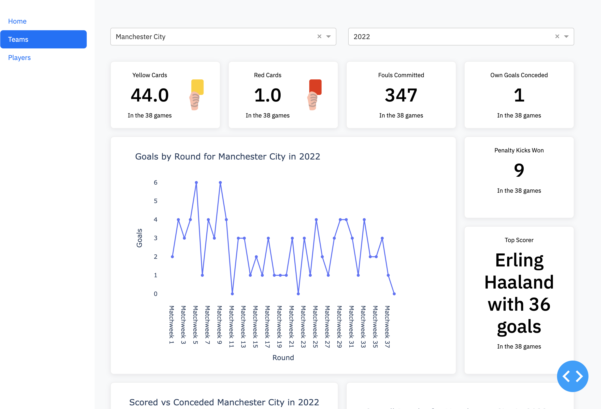
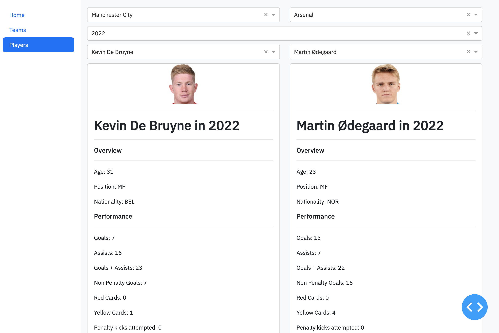

# Premier-League-Dashboard

# Premier League Data Scraper and Visualization Dashboard

## Introduction
This project is a Premier League data scraper and visualization dashboard built using Python, Dash, Plotly, and Pandas. It allows users to scrape Premier League match data, scores, fixtures, and player data, and provides a user-friendly dashboard for visualizing and analyzing the data related to their favorite team and players.

## Tools and Technologies Used
- **Python**: The project is primarily built using Python, a versatile and powerful programming language.
- **Dash**: Dash is a Python framework for building analytical web applications. It's used to create the interactive dashboard for visualizing the Premier League data.
- **Plotly**: Plotly is a Python graphing library that powers the interactive plots and charts in the dashboard.
- **Pandas**: Pandas is a popular data manipulation library in Python, used for cleaning and processing the scraped data.
- **Web Scraping**: We utilize web scraping techniques to gather Premier League match data, scores, fixtures, and player information.
- **GitHub**: The project is hosted on GitHub, making it easy for collaboration and version control.
- **MIT License**: The project is open source and licensed under the MIT License, allowing for free and open usage and contributions.

These technologies work together to provide an efficient and user-friendly way to explore and visualize Premier League data.

## Project Highlights

- **Data Scraping**: Built web scrapers using Requests and BeautifulSoup to extract Premier League match data from FBRef. Automated data extraction and cleaning, reducing extraction time by 30%.

- **Data Manipulation**: Utilized Pandas to wrangle, merge, and transform datasets from multiple seasons and teams. Implemented robust error handling for scrapers.

- **Interactive Visualizations**: Developed an interactive dashboard with Matplotlib to visualize key performance metrics, including goals, assists, xG, and defensive actions for players and teams.

- **Advanced Metrics**: Enabled analysis of detailed statistics such as shooting accuracy, pass completion percentage, and duel success rate, allowing for comprehensive player performance evaluation over time.

- **User-Friendly Interface**: Designed interactive visuals and filters to facilitate player comparisons across positions and seasons. Simplified complex data for quick insights.

This project offers a comprehensive toolset for analyzing Premier League match and player statistics with a focus on ease of use and data accuracy.

## Demo

